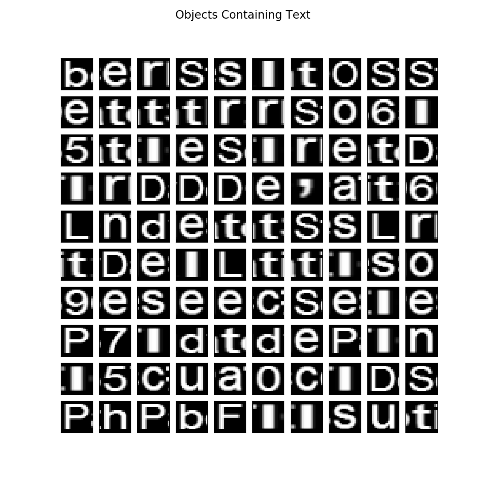

# Dicom Scraper

This is currently under development, and builds a Singularity image to run text (letter detection) on a demo image. If this is a route we want to go, this can be tweaked to accept a dicom file, and have some logic for finding and removing classified regions.


## Singularity
A build script is provided that (first removes any existing image) and then builds as follows:

```
singularity create --size 6000 scraper.img
sudo singularity bootstrap scraper.img Singularity
```

Complete credit for the base work goes to [@FraPochetti](http://francescopochetti.com/portfoliodata-science-machine-learning/), I just wrapped the functions in a container, added xvfb and other dependencies to (hopefully) reproduce most of the versions that he used, and then added functions to save to file.


## Example Output
Right now, we are focused on just finding text. I found a random online image of a dicom file with a bunch of text, and went through different steps:

### Objects


### Candidate Objects




### Single Character Recognition

We don't really care about this one.


### Text that Would be Removed
This is the part that (I think) we care about, this is a crappy plot of showing which text would be removed. I think we can ignore the purple region, for our purposes, we would remove all the text found in the image.


