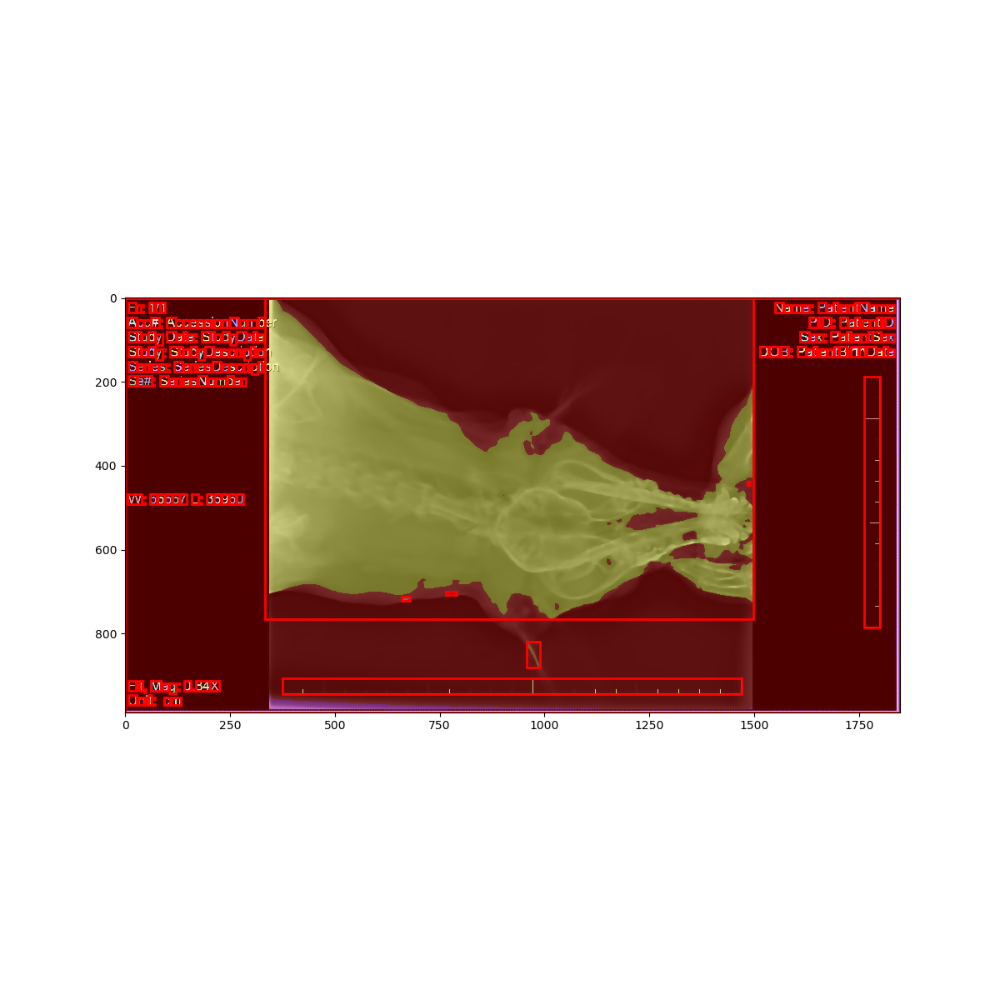
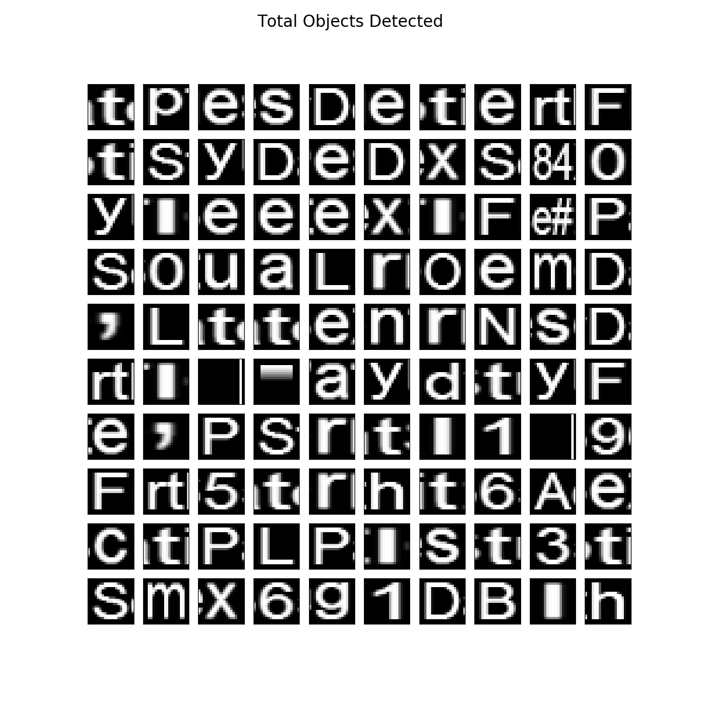
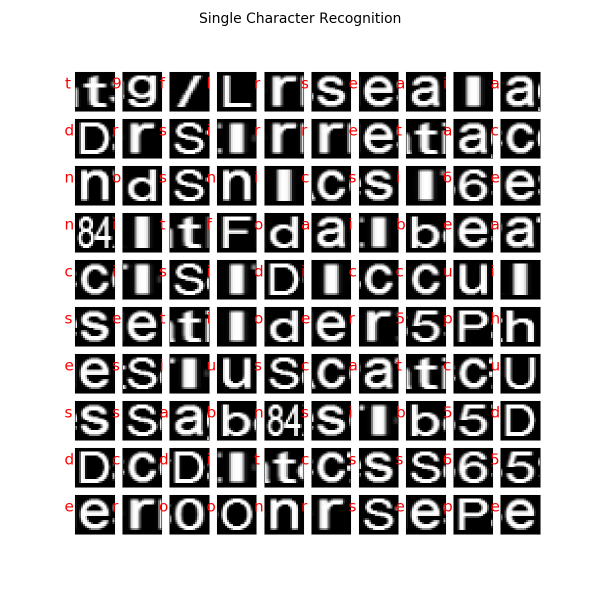
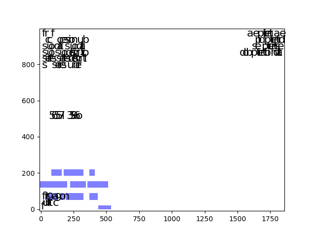

# Dicom Scraper

This is currently under development, and builds a Singularity image to run text (letter detection) on a demo image. If this is a route we want to go, this can be tweaked to accept a dicom file, and have some logic for finding and removing classified regions.

## Docker
First, to build the image (or just skip to download and use version built on [Docker Hub](https://hub.docker.com/r/vanessa/dicom-scraper/)):

```
docker build -t vanessa/dicom-scraper .
```

Then to run it, you can first see if it works:

```
docker run vanessa/dicom-scraper --help
```

and you should see usage

```
usage: main.py [-h] [--input FOLDER] [--outfolder OUTFOLDER] [--verbose]

Deid (de-identification) pixel scaping tool.

optional arguments:
  -h, --help            show this help message and exit
  --input FOLDER, -i FOLDER
                        input folder to search for images.
  --outfolder OUTFOLDER, -o OUTFOLDER
                        full path to save output, will use /data folder if not
                        specified
  --verbose, -v         if set, print more image debugging to screen.
```

We see that you should provide a folder with dicom files to the `--input` argument. If you want to see the image files preprocessed (with contenders in red boxes), you should also map a `--volume`. Let's cd to some folder with dicom images, and then map it (the `$PWD` to /data) in the container. We will specify `--input` to be `/data`, meaning the mapped folder with our images.

```
cd dicom_folder
docker run --volume $PWD:/data vanessa/dicom-scraper --input /data
``` 

You'll see the pixels that are being cleaned, and the output (png files for preview) in the same folder (the deprecation warnings need to be disabled):

```
vanessa@vanessa-ThinkPad-T460s:~/Documents/Dropbox/Code/som/dicom/deid/phi_in_image_pixels$ docker run --volume $PWD:/data vanessa/dicom-scraper --input /data
DEBUG Found 5 contender files in data
DEBUG Checking 5 dicom files for validation.
/opt/anaconda2/lib/python2.7/site-packages/skimage/transform/_warps.py:84: UserWarning: The default mode, 'constant', will be changed to 'reflect' in skimage 0.15.
  warn("The default mode, 'constant', will be changed to 'reflect' in "
/opt/anaconda2/lib/python2.7/site-packages/skimage/feature/_hog.py:119: skimage_deprecation: Default value of `block_norm`==`L1` is deprecated and will be changed to `L2-Hys` in v0.15
  'be changed to `L2-Hys` in v0.15', skimage_deprecation)
WARNING 1.2.840.113619.2.59.2156250086.549.978711541.365 is flagged for text content.
WARNING 1.2.840.113619.2.59.2156250086.517.978711330.290 is flagged for text content.
WARNING 1.2.840.113619.2.59.2156250086.517.978711330.288 is flagged for text content.
WARNING 1.2.840.113619.2.59.2156250086.549.978711541.366 is flagged for text content.
WARNING 1.2.840.113619.2.59.2156250086.541.978710307.766 is flagged for text content.
Found 5 valid dicom files
Scrubbing (108,0,408,512)
Scrubbing (418,200,431,230)
Scrubbing (418,241,431,245)
Scrubbing (418,255,431,263)
Scrubbing (422,268,431,287)
Scrubbing (422,288,435,296)
Scrubbing (437,202,452,214)
Scrubbing (437,214,450,222)
Scrubbing (437,223,452,236)
Scrubbing (437,239,450,245)
============================================================
Scrubbing (48,255,63,271)
Scrubbing (50,249,63,253)
Scrubbing (54,276,63,295)
Scrubbing (54,296,67,304)
============================================================
Scrubbing (64,0,447,512)
Scrubbing (438,268,447,287)
Scrubbing (438,288,451,296)
Scrubbing (453,202,468,214)
Scrubbing (453,214,466,222)
Scrubbing (453,223,468,236)
Scrubbing (453,239,466,245)
============================================================
Scrubbing (90,184,103,214)
Scrubbing (90,225,103,229)
Scrubbing (90,239,103,247)
Scrubbing (94,252,103,271)
Scrubbing (94,272,107,280)
Scrubbing (109,0,474,512)
Scrubbing (109,198,122,206)
Scrubbing (109,223,122,229)
============================================================
Scrubbing (62,283,69,288)
Scrubbing (73,302,80,307)
Scrubbing (90,330,97,335)
============================================================
```

## Singularity
A build script is provided that (first removes any existing image) and then builds as follows:

```
singularity create --size 6000 scraper.img
sudo singularity bootstrap scraper.img Singularity
```

Complete credit for the base work goes to [@FraPochetti](http://francescopochetti.com/portfoliodata-science-machine-learning/), I just wrapped the functions in a container, added xvfb and other dependencies to (hopefully) reproduce most of the versions that he used, and then added functions to save to file.


## Example Output
Right now, we are focused on just finding text. I found a random online image of a dicom file with a bunch of text, and went through different steps. First, here are all the Objects, detected on the image (note this is a a random image with text I found on Google):




### Objects
And here they are extracted from the image. Note that some of these aren't letters but just blocks with lines:




### Single Character Recognition

We don't really care about this one, it's an attempt to say what letter is what.




### Text that Would be Removed
This is the part that (I think) we care about, this is a crappy plot of showing which text would be removed. I think we can ignore the purple region, for our purposes, we would remove all the text found in the image.




For all of the above, this would need some careful work to tweak and test with dicom, and add a step to black out text, and then do test runs with different kinds of burnt text and see what happens.
